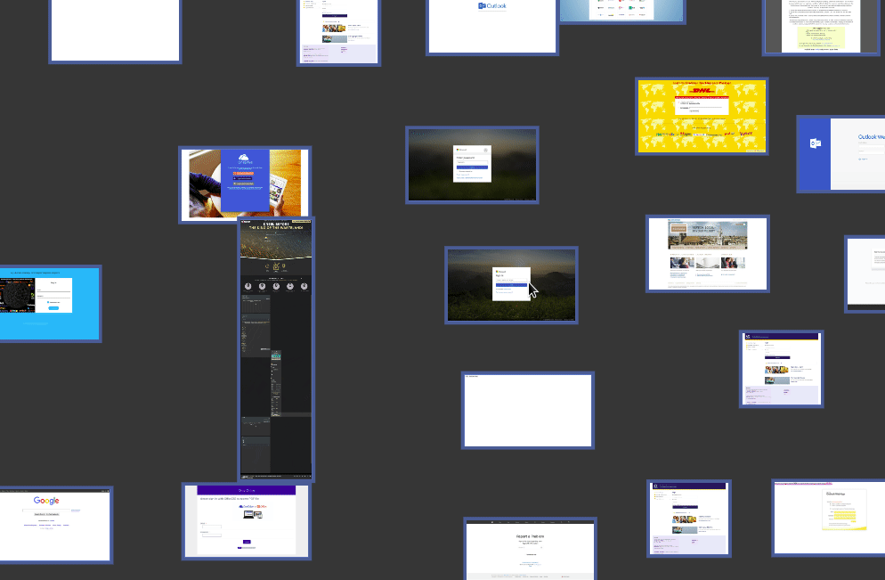
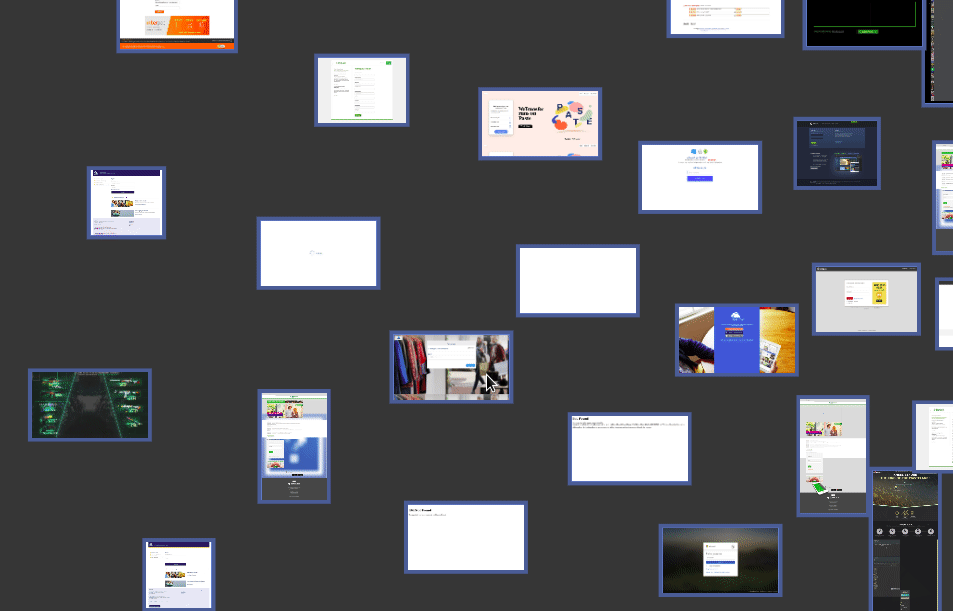
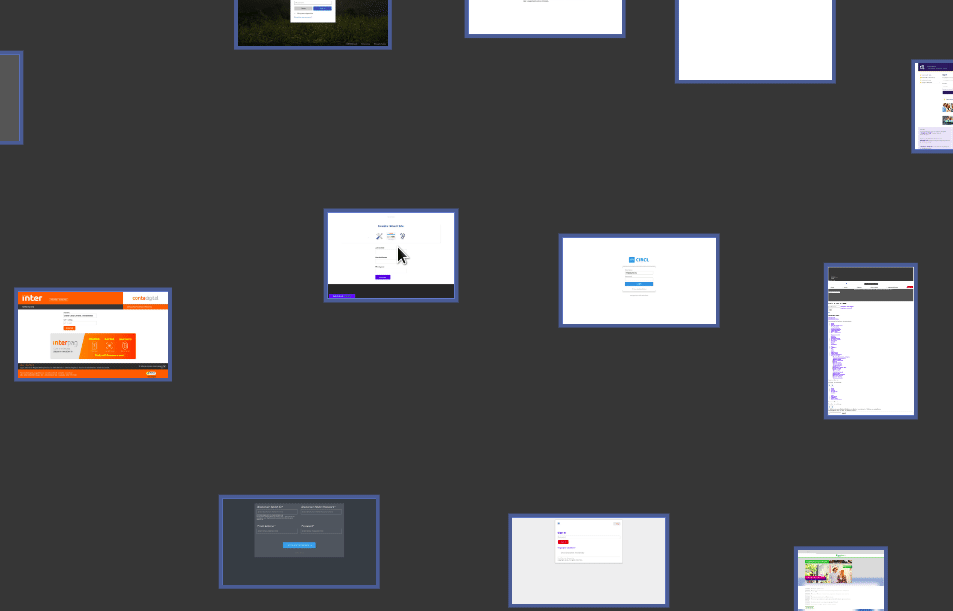
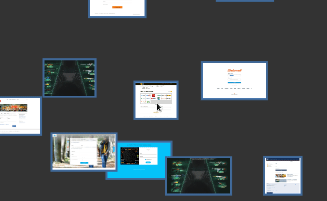
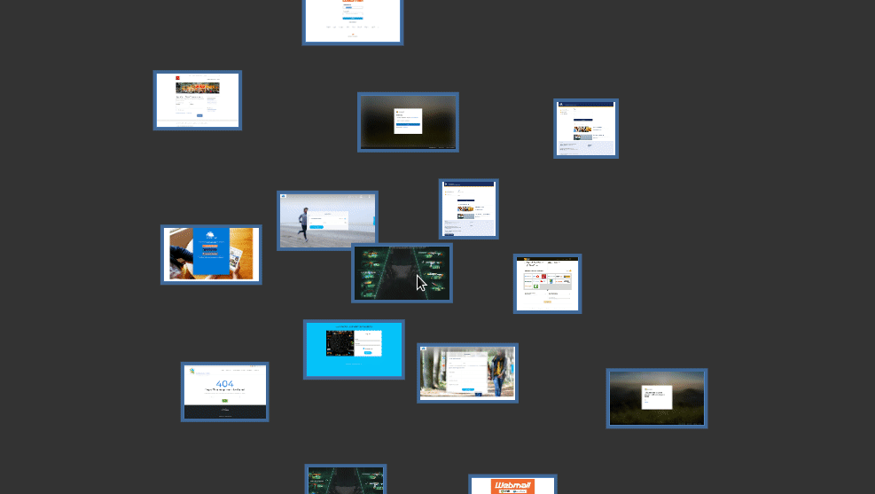

# visjs_classificator
Classificator for pictures matching and clustering. Fast and visual.

Uses VISjs and Socket.io to allow image classification/pairing, by hand, with multiuser.

Note : GIF performance is not representative of real time performance.

### Launch

> node server.js
or 
> ./launch_server.sh 

If you want to load a previously saved json file : 
> nodejs server.js <nameOfYourFile>.json 

### Launch (dev)

if you have nodemon or want to develop the tool : 
> ./watch_server.sh 

### Interaction and usage
CTRL + clic to select more than one node at a time.

After a selection of multiple node, press "M" to create a complete graphe.

Double-clic on a node to make it "fixed" on the screen (your screen only). Perform again to un-fix a node.

Right-clic + drag to draw a selection rectangle

With selection of nodes, press "c" to generate an anchor. If you link a picture to an anchor, you add this node to the cluster.

### Performance
Tested up to 1500 pictures at the same time. May still have some tricks to perform to go higher. Depends of your configuration.

### Todo list 
- Rectangle selection : Clic + CTRL Done, rectangle would still need to be done : Done
- When double clic and moved, the node stays where it is (fixed property isk kept on dragging) : Done
- Simple and double arrows support
- Order on a grid (See Mokkadev repository)
- Selection rectangle : Done
- Increase link size : Done
- Show one or many links between pictures

Good links to get started if you're lost : 
> https://medium.com/jeremy-keeshin/hello-world-for-javascript-with-npm-modules-in-the-browser-6020f82d1072 
> https://github.com/jkeesh/hello-browser-npm
> https://socket.io/docs/emit-cheatsheet/
